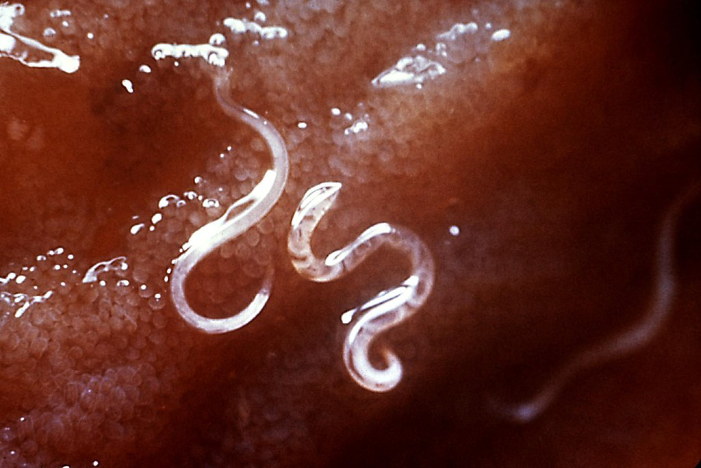
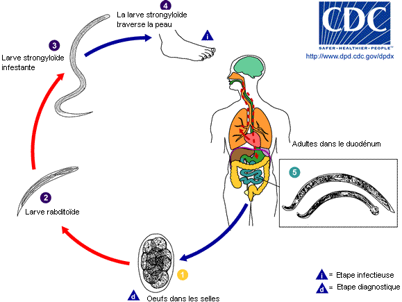

```{=pdf}
<style>

body {

text-align: justify}

</style>
```

```{r setup, include=FALSE}
knitr::opts_chunk$set(echo = TRUE)
```
\newpage 

```{r message=FALSE,warning=FALSE, echo=FALSE}
### LIBRAIRIES UTILISEES ###
library(dplyr)
library(ggplot2)
library(gt)
```

# Introduction 

A travers ce projet, nous allons utiliser les données provenant d'une enquête réalisée sur un échantillon d'individus en Egypte. Plus particulièrement, nous avons des informations concernant l'infection des individus par l'ankylostome. En marchant pieds nus, les individus sont contaminés via les larves des ankylostomes vivant en terre. L'infection peut aussi se produire via une ingestion d'aliments contaminés par des larves. Les différents symptômes posibles sont des éruptions et lésions cutannées aux endroits où les larves ont pénétré la peau, de la fièvre, des douleurs épigastriques, des diarrhées, de la toux, inflammation de l'intestin ... . Dans les cas les plus graves, le malade peut être victime d'une perte de sang (les larves dans l'intestin se nourrissent de sang en étant accroché à sa paroi et il en résulte une potentielle anémie pour le malade), d'insuffisance cardiaque. Il existe des médicaments antiparasitaires pour traiter cette infection (albendazole, mébendazole). 

L'ankylostome vit particulièrement bien dans la terre et une température aux alentours des 18°C afin que les oeufs puissent éclore. Les oeufs d'ankylostomes ont l'allure suivante:

{width=40%}

Et par la suite, deviennent les des vers se propageant vers l'intestin:

{width=40%}

Voici le cycle parasitaire de l'ankylostome:

{width=40%}

\newpage


# I. Lecture des données et vérification 
```{r, echo=FALSE}
### LECTURE DES DONNEES ET MODALITES ###
data <- read.csv("Ankylostome.csv")
data <- data %>% select(-c(...1, X))

modalites_uniques <- lapply(data, function(colonne) {
  unique_values <- unique(colonne) 
  count_values <- length(unique_values) 
  list(Modalites = unique_values, Nombre = count_values)
})

```

A travers le tableau suivant, voici un récapitulatif de nos données: 

| Nom de la variable | Type   | Modalités ou exemples de modalités          |
|--------------------|--------|---------------------------------------------|
| id                 | int    | 440, 336, 60, ...                           |
| age                | int    | 2, 3, 4, 5, 6, 7, 8, 9, 10, 11, 12, ...     |
| agegr              | chr    | <15 yrs, 15-59 yrs, 60+ yrs                 |
| zone               | chr    | Nord, Ouest, Sud, Est                       |
| sexe               | int    | 0 (masculin ?), 1 (féminin ?)               |
| chaussures         | chr    | "no", "yes"                                 |
| nb.oeufs           | int    | 0, 46, 184, 989, 1150, 690, ...             |
| intensite          | chr    | 0, "[1;1.999]", "[2;+]"                     |
| ageclasses         | chr    | <16 ans, 16-49, 49 et plus                  |


Voici l'allure générale de nos données: 
```{r, echo=FALSE}
### ALLURE GENERALE DES DONNÉES ###
head(data)

```

## I.1 Informations concernant les individus 

La table de données contient 238 hommes et 399 femmes et ils sont répartis de la manière suivante selon la zone géographique: 


```{r, echo=FALSE}
### SEXE DES INDIVIDUS ###
table_sexe <- table(data$sexe)

### REPARTITION SELON LES ZONES ###
ggplot(data, aes(x = zone, fill = as.factor(sexe))) +
  geom_bar(position = "dodge") +
  labs(
    title = "Répartition des sexes par zone",
    x = "Zone",
    y = "Nombre de personnes",
    fill = "Sexe"
  ) +
  scale_fill_manual(
    values = c("0" = "blue", "1" = "pink"),
    labels = c("0" = "Hommes", "1" = "Femmes")
  ) +
  theme_minimal()

```


Regardons les catégories d'âges. Trois variables sont à notre disposition: age, agegr et ageclasses. 


```{r, echo=FALSE}
### AGE DES INDIVIDUS ###
age <- summary(data["age"])
agegr <- table(data$agegr)
ageclasses <- table(data$ageclasses)

```
Concernant la variable \textbf{age}: 

| Statistique   | Valeur |
|---------------|--------|
| Min.          | 2.00   |
| 1st Qu.       | 9.00   |
| Median        | 23.00  |
| Mean          | 25.94  |
| 3rd Qu.       | 40.00  |
| Max.          | 78.00  |

Concernant la variable  \textbf{agegr}:

| Catégorie    | Valeur |
|--------------|--------|
| <15 yrs      | 259    |
| 15-59 yrs    | 331    |
| 60+ yrs      | 47     |

Concernant la variable \textbf{ageclasses}:

| Catégorie    | Valeur |
|--------------|--------|
| <16 ans      | 259    |
| 16-49 ans    | 331    |
| 49 et plus   | 47     |


## I.2 Création de la variable "malade" et observations

Afin de réaliser notre étude, nous créons la variable \textbf{malade}. Nous considérons qu'un individu est infecté si la variable \textbf{nb.oeufs} est supérieur à 0. La variable malade vaudra 0 si la variable \textbf{nb.oeufs} est égal à 0, sinon elle vaudra 1.

Suite à cette création nous constatons qu'il y a 197 personnes non malades (31% de l'échantillon) et 440 personnes malades (69% de l'échantillon), pour un total de 637 personnes. 

```{r, echo=FALSE}
### CREATION DE LA VARIABLE MALADE ET OBSERVATIONS ###
data <- data %>% mutate(malade = ifelse(nb.oeufs == 0, 0, 1))
malades <- table(data$malade)
pourcentages_malades <- prop.table(malades) * 100

```

## I.3 Quelques analyses préliminaires ...

### I.3.a ...via des graphiques

La répartition des sexes par zone géographique selon l'infection: 
```{r, fig.align='center', echo=FALSE}
### répartition des sexes par zone géographique selon l'infection ###
ggplot(data, aes(x = as.factor(sexe), fill = as.factor(malade))) +
  geom_bar(position = "stack") +   
  facet_wrap(~ zone) +             
  labs(title = "Répartition des malades par sexe et zone",
       x = "Sexe",
       y = "Nombre de cas",
       fill = "État de l'infection") +   
  scale_fill_manual(values = c("lightblue", "orange")) +  
  theme_minimal()  

```

La répartition des personnes infectées et le port de chaussures: 

```{r, fig.align='center', echo=FALSE}
### répartition des personnes infectées et le port de chaussures ###
ggplot(data, aes(x = chaussures, fill = as.factor(malade))) +
  geom_bar(position = "stack") +   
  labs(title = "Répartition des personnes infectées selon le port de chaussures",
       x = "Type de chaussures",
       y = "Nombre de cas",
       fill = "État de l'infection") +   
  scale_fill_manual(values = c("lightblue", "orange")) +  
  theme_minimal()  

```

La répartition des personnes infectées selon leur âge. Pour cela nous allons créer une nouvelle variable age_categ car les deux autres variables qui classent les âges ne nous semblent pas représentatives. Voici les tranches choisies: \newline
- 0 à 5 ans exclus, \newline
- 5 ans à 10 ans exclus, \newline
- 10 ans à 18 ans exclus, \newline
- 19 ans à 30 ans exclus, \newline
- 30 à 60 ans exlus, \newline
- les plus de 60 ans

```{r, fig.align='center', echo=FALSE}
### CREATION DES CLASSES D'AGE ET GRAPHIQUE ###
data$age_categ <- cut(data$age, 
                      breaks = c(0, 5, 10, 18, 30, 60, Inf), 
                      labels = c("0-5 ans", "5-10 ans", "10-18 ans", "19-30 ans", "30-60 ans", "60+ ans"),
                      right = FALSE) 

data_malade <- subset(data, malade == 1)

ggplot(data_malade, aes(x = age_categ)) +
  geom_bar(fill = "lightblue") +
  labs(title = "Répartition des personnes infectées par tranches d'âge",
       x = "Âge",
       y = "Nombre de personnes infectées") +
  theme_minimal()

```

### I.3.a ...via le test du khi-deux

Le $\chi^2$ permet de vérifier une relation entre deux variables qualitatives et de comparer des répartitions d'effectifs. Nous allons réaliser un text du khi-deux d'homogénéité et d'indépendance. 

De plus, nous restons vigilants à la contrainte suivante : 80% des effectifs doivent être supérieurs à 5 individus.

Nous testons l'hypothèse nulle H0, les deux variables sont indépendantes contre H1, il existe une relation entre les deux variables testées.

Dans un premier temps, nous réaliserons ce test avec *zone* en tant que variable cible, avec *chaussures*, *age_categ* et *sexe*. Ensuite, nous réaliserons ce test entre *age_categ* et *chaussures*, *age_categ* et *sexe*, *chaussures* et *sexe*.

```{r}

resultat <- data.frame(
  variable_cible = character(),
  variable_testee = character(),
  p_valeur = numeric(),
  interpretation = character())

tests <- list(
  list(cible = "zone", testee = "chaussures"),
  list(cible = "zone", testee = "age_categ"),
  list(cible = "zone", testee = "sexe"),
  list(cible = "age_categ", testee = "chaussures"),
  list(cible = "age_categ", testee = "sexe"),
  list(cible = "chaussures", testee = "sexe")
  
)

for (test in tests) {
  cible <- test$cible
  testee <- test$testee
    table_contingence <- table(data[[cible]], data[[testee]])
  
  if (any(chisq.test(table_contingence)$expected < 5)) {
    p_valeur <- NA
    interpretation <- "Test invalide (effectifs attendus < 5)"
  } else {
    test_resultat <- chisq.test(table_contingence)
    p_valeur <- test_resultat$p.value
    interpretation <- ifelse(
      p_valeur < 0.05,
      paste("Dépendance entre", cible, "et", testee),
      paste("Indépendance entre", cible, "et", testee)
    )
  }
  
  resultat <- rbind(
    resultat,
    data.frame(
      variable_cible = cible,
      variable_testee = testee,
      p_valeur = round(p_valeur, 4),
      interpretation = interpretation
    )
  )
}

resultat %>%
  gt() %>%
  tab_header(
    title = "Test du khi-deux",
    subtitle = "Analyse des relations entre variables"
  ) 

```

# II. Modèle (à changer)

Le modèle choisi est le suivant : MODELE TROP GROS a priori pour interpréter avec les odds

$$malade = \beta_{0} + \beta_{1} * age + \beta_{2} * sexe + \beta_{3} * chaussuresyes  + \beta_{4} * zoneNord + \beta_{5} * zoneOuest + \beta_{6} * zoneSud $$
```{r}
### MODELE DE REGRESSION ###
res <- glm(malade ~ age + sexe + chaussures + zone, family="binomial", data=data)

```

Les valeurs des coefficients sont les suivantes:
```{r, results='hide', echo=FALSE}
### VALEURS DES COEFFICIENTS ###
res$coefficients

```
| Variable       | Coefficient   | Notation          |
|----------------|---------------|-------------------|
| (Intercept)    | 0.80710299    | \(\hat{\beta_0}\) |
| age            | 0.02076273    | \(\hat{\beta_1}\) |
| sexe           | 0.11107693    | \(\hat{\beta_2}\) |
| chaussuresyes  | -0.41702146   | \(\hat{\beta_3}\) |
| zoneNord       | -0.55788369   | \(\hat{\beta_4}\) |
| zoneOuest      | -0.38105327   | \(\hat{\beta_5}\) |
| zoneSud        | -0.46207829   | \(\hat{\beta_6}\) |

Intervalles de confiance: 

```{r, echo=FALSE}
### INTERVALLES DE CONFIANCE ###
confint(res, level=0.95)

```

# III. Prédictions 

```{r, results='hide'}
### PREDICTIONS ###
vect_estimations <- round(res$fitted.values)

#Effectif
tab=table(data$malade, vect_estimations)
tab

#Proportion de personnes pour laquelle la prédiction a été mauvaise: 197 (1 + 196)
#1. => 31%
(tab[1,2] + tab[2,1])
(tab[1,2] + tab[2,1])/sum(tab)

#2. Proportion de personnes infectées pour laquelle la prédiction était non infecté: 31% (faux positifs)
tab[1,2]/sum(tab[,2])

#3. Proportion de personnes non infectées pour laquelle la prédiction était infectées => 50% (faux négatifs)
tab[2,1]/sum(tab[,1])

```


# Conclusion 

A MODIFIER 

Il est important de noter que pour prévenir la population de ce type d'infection, il vaut mieux éviter de marcher pieds nus, d'utiliser des eaux usées et de bien utiliser des dispositifs de toilettes, d'hygiène pour éviter la présence de selles au sol. Le diagnostic de l'infection peut-être réalisé via un examen d'un échantillon de selles ou d'analyse de sang. 
\newpage 

# Annexe Code R 
```{r ref.label=knitr::all_labels(), echo=TRUE, eval=FALSE}
```

